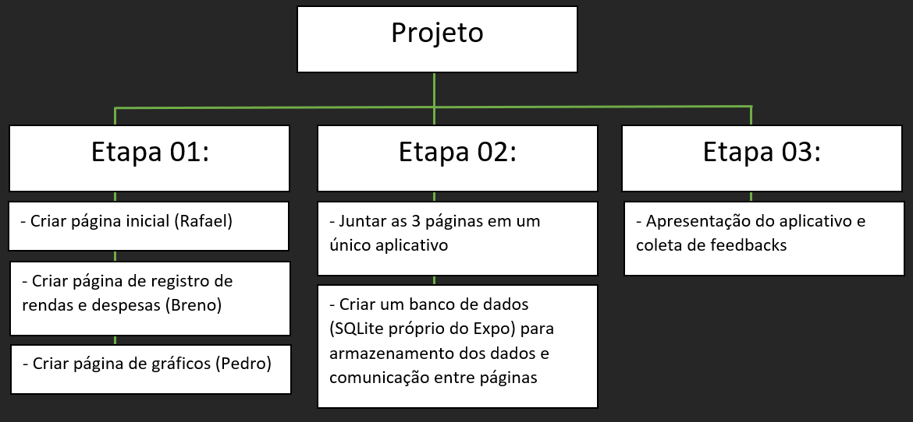
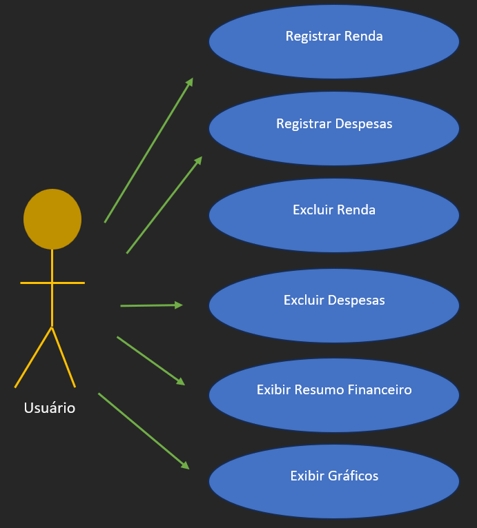
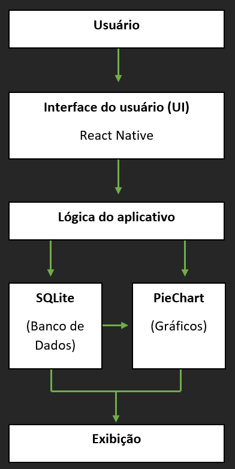
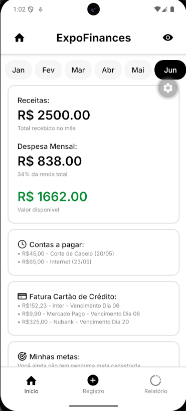
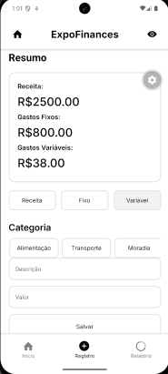
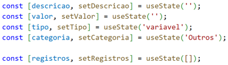
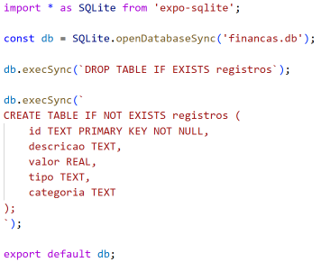
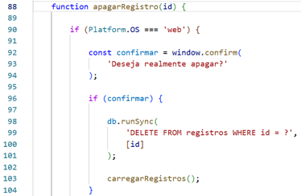
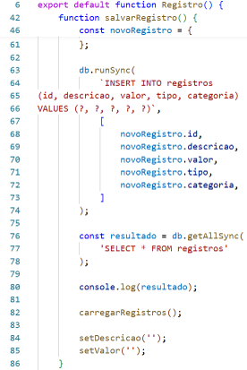
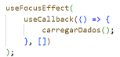

# ExpoFinances - Organizador Financeiro

🛠️ App em React Native + ExpoGo  
👨‍💻 Breno Henrique Ninin | Pedro Marques da Cruz | Rafael Lopo Montalvão

Este foi um projeto executado durante o primeiro semestre de 2026 na matéria extensionista "Programação Para Dispositivos Móveis em Android" ministrada pelo professor Omar Sacilotto Donaires e realizado pelos alunos Breno Henrique Ninin, Pedro Marques da Cruz e Rafael Lopo Montalvão. A matéria extensionista tem objetivo de através de um projeto baseado nos conteúdos ensinados durante o semestre realizar a extensão entre alunos da faculdade e a comunidade.
O projeto rendeu muitos aprendizados para os membros do grupo e todos passaram com nota máxima na matéria. Após o término do semestre o grupo tem intenção de continuar trabalhando no projeto para fins de estudo, uso pessoal e disponibilização do app para pessoas que tenham interesse.

# Identificação das partes interessadas e parceiros

O projeto tem como público-alvo usuários com dificuldades no controle financeiro pessoal, especialmente indivíduos com baixa educação financeira. Esses participantes incluem pessoas que enfrentam problemas como desorganização de gastos, endividamento e ausência de planejamento em busca de alternativas para gerenciar melhor suas finanças.
Em relação ao perfil, trata-se de um público diversificado, composto por diferentes faixas etárias, niveis de escolaridade e condições socioeconômicas, com predominância de estudantes e trabalhadores que necessitam de ferramentas simples e acessíveis para o controle financeiro.

# Problemática e/ou problemas identificados

A população brasileira enfrenta um grande problema de endividamento e muitos fatores contribuem para o aumento exponencial do número de inadimplentes na sociedade. Em conversas com pessoas nessa situação foi constatado que muitos não sabem com precisão quantos reais foram gastados no mês, não conseguem guardar dinheiro e não possuem um planejamento financeiro. Apesar do celular ser presente no cotidiano da população suas tecnologias não auxiliam de forma fácil os usuários a terem uma melhor organização de suas finanças, como foi nos relatado durante as entrevistas realizadas. Ao apresentarmos a ideia de um aplicativo que possa ajudar nos gastos do dia a dia, percebeu-se um ânimo dos entrevistados com a possibilidade de ter o controle dos gastos de forma simples, inclusive com o retorno de que se ele estivesse pronto já estariam utilizando-o.

# Justificativa

Entre muitos motivos, a realização deste projeto se apresenta pertinente quando em entrevistas com as partes interessadas observamos uma má educação financeira, muitos casos de endividamentos e ausência de um planejamento financeiro pela maioria do sentrevistados, com a experiência de alguns que tentaram realizar porém encontraram dificuldades na manipulação de ferramentas que poderiam auxiliá-los. Destaca-se que esses tópicos não é percebido apenas no contexto das entrevistas realizadas. No que se refere a educação financeira, destaca-se a atuação do governo na criação da Estratégia Nacional de Educação Financeira (ENEF) em 2010 (BANCO CENTRAL DO BRASIL. 2013). Sobre os endividamentos, o Serasa através de seus mapas divulgou um número de 82,8 milhões de inadimplentes, cerca de 50,51% da população total do Brasil (SERASA EXPERIAN, 2026). Acerca do último tópico, a psicóloga Maria Adriana Campêlo relata que a ausência de um planejamento financeiro bem estruturado dificulta o controle das finanças pessoais e contribuiu para o risco de endividamento (CAMPÊLO, 2023). Além disso, apenas 17,4% da população brasileira possuem habilidades intermediárias no contexto digital que, entre outras competências, compreende a capacidade de usar fórmulas aritméticas em uma planilha (ANATEL, 2024).
Através da elaboração de uma aplicação móvel, conteúdo central da disciplina, será possível colocar todos os conhecimentos adquiridos em prática e em uma situação de problema real da sociedade, foco do objetivo extensionista. Para o grupo essa experiência se torna uma grande oportunidade de aprendizagem em uma plataforma desconhecida previamente, os aparelhos celulares, e uma experiência de desenvolvimento em contato com a população e melhorias baseadas em avaliações que produzirá frutos em diversas áreas acadêmicas e profissionais.

# Objetivos/resultados/efeitos a serem alcançados

- Permitir o registro e categorização de receitas e despesas.
- Exibir gráficos com resultados financeiros.
- Desenvolvimento do aplicativo em que todos os membros do grupo se envolvam na participação.

# Referencial teórico

O endividamento é presente na vida de muitos brasileiros com atualmente cerca de 82,8 milhões de pessoas em situação de inadimplência, o que corresponde a 50,51% da população total (SERASA EXPERIAN, 2026). Na busca de encontrar possíveis soluções o governo em 2010 elaborou uma política pública permanente – a Estratégia Nacional de Educação Financeira (ENEF) – que busca confrontar a realidade de uma sociedade com educação financeira baixa, disseminando conhecimento para promover maior estabilidade econômica (BANCO CENTRAL DO BRASIL, 2013). Observa-se, portanto, que a temática da educação financeira reflete em uma preocupação de âmbitos nacionais. Indo mais adiante nas raízes do problema a psicóloga Maria Adriana Campêlo relata que a ausência de um planejamento financeiro bem estruturado dificulta o controle das finanças pessoais e contribui para o risco de endividamento (CÂMPELO, 2023). Em relação ao uso de ferramentas digitais no auxílio da criação de um plano financeiro enfrenta-se uma questão muito presente nos dias atuais: a dificuldade na utilização. Um estudo elaborado pela Superintendência de Relações com os Consumidores (SRC) da Anatel sobre as habilidades digitais no Brasil revela que apenas 17,4% da população brasileira possuem habilidades intermediárias que, entre outras competências, compreende a capacidade de usar fórmulas aritméticas em uma planilha (ANATEL, 2024). Portanto, levando em consideração os problemas de falta de educação financeira, suas formas de gestão e dificuldade em manipulação de ferramentas que auxiliem no controle, tais problemáticas influenciam, mesmo que indiretamente, no aumento do endividamento da população brasileira. O controle das finanças pessoais é essencial para decisões mais conscientes e uma relação mais equilibrada com o dinheiro, aponta a gerente de negócios da Unicred Pelotas, Danielle Gastaldo (A HORA DO SUL, 2026). Nesse contexto, o desenvolvimento de uma aplicação de celular de controle financeiro surge como uma ferramenta prática e acessível, capaz de auxiliar os mais diversos tipos de usuários na organização de suas contas, bem como na criação de hábitos financeiros mais saudáveis. O aplicativo propõe-se a ser capaz de registrar rendas, despesas e gerar gráficos com relatórios dos resultados financeiros, permitindo um maior controle e visualização das movimentações que o usuário faz durante o mês e ano.

REFERÊNCIAS:

A HORA DO SUL. Falta de planejamento ainda é principal causa do endividamento, diz especialista. 29 jan. 2026. Disponível em: https://ahoradosul.com.br/conteudos/2026/01/29/falta-de-planejamento-ainda-e-principal-causa-do-endividamento-diz-especialista/. Acesso em: 28 abr. 2026.

ANATEL. Habilidades Digitais no Brasil e no Mundo. 11 jun. 2024. Disponível em: https://sei.anatel.gov.br/sei/modulos/pesquisa/md_pesq_documento_consulta_externa.php?8-74Kn1tDR89f1Q7RjX8EYU46IzCFD26Q9Xx5QNDbqbIGuBQvTrV78dFpuB7IKQqoNrnZCOZ3jtE5kL3VAa5556cOPI5SUdQPc8loctKVzQanQNRvcIh1XFEKYys8Yfr. Acesso em: 28 abr. 2026.

BANCO CENTRAL DO BRASIL. BRASIL: IMPLEMENTANDO A ESTRATÉGIA NACIONAL DE EDUCAÇÃO FINANCEIRA. 04 dez. 2013. Disponível em: https://www.bcb.gov.br/pre/pef/port/Estrategia_nacional_Educacao_Financeira_ENEF.pdf. Acesso em: 28 abr. 2026.

CAMPÊLO, Maria Adriana. Dívida: fatores comportamentais e seus efeitos psicológicos. 22 jun. 2023. Disponível em: https://www.gov.br/investidor/pt-br/penso-logo-invisto/dividas-fatores-comportamentais-e-seus-efeitos-psicologicos. Acesso em: 28 abr. 2026.

SERASA EXPERIAN. Mapa da Inadimplência e Renegociação de Dívidas: março de 2026. 23 abr. 2026. Disponível em: https://www.serasa.com.br/limpa-nome-online/blog/mapa-da-inadimplencia-e-renogociacao-de-dividas-no-brasil/. Acesso em: 29 abr. 2026.

# Plano de traballho

Etapas do desenvolvimento do projeto, conforme plano de aprendizagem:
1.	Definição do grupo de trabalho e partes interessadas:
Grupo definido em 06 de março com adição do membro Bruno Henrique Ninin em 20 de março. Partes interessadas identificadas e entrado em contato com possíveis usuários via whatsapp ou presencialmente. Prazo máximo para a coleta total dos 12 voluntários (4 por cada integrante do grupo) até 08 de maio.
2.	Diagnóstico e teorização do projeto:
Seções 1.1 a 1.5 do roteiro que será apresentado através de um seminário de diagnóstico no dia 24 de abril e entregue até 01 de maio.
3.	Planejamento e desenvolvimento do projeto:
Seções 2.1 a 2.5 do roteiro que será apresentado através de um seminário de planejamento no dia 24 de abril e entregue até 01 de maio.
4.	Detalhamento técnico do projeto:
Seção 2.6 do roteiro onde inclui toda a parte do desenvolvimento da aplicação, uso pelos participantes do projeto, correções, implementações das funções, feedbacks, etc. Será apresentado através de um seminário de desenvolvimento no dia 22 de maio e entregue até 19 de junho.
5.	Encerramento do Projeto:
Seções 3.1 e 3.2 do roteiro onde será relatado as experiências coletivas do grupo sobre o projeto e também a experiência indivudal. Será entregue até 19 de junho.
6.	Apresentação do projeto:
Será realizado um seminário de avaliação com a apresentação no dia 19 de junho.

Para além do plano de aprendizagem o grupo estabelece 4 períodos na produção do projeto:
1º período: Identificação do problema, coleta de informações de possíveis usuários e a aceitação da aplicação feita através de conversas via Whatsapp ou presenciais e apresentação do projeto em sua fase inicial para o público visitante do PEI;
2º período: Começo do desenvolvimento da aplicação e disponibilização da versão base;
3º período: Primeiro formulário de avaliação sobre as funcionalidades e interatividade do aplicativo, buscando aprimorar o que foi feito e adicionar novas funções;
4º período: Iniciará após a finalização das funções propostas no início do aplicativo e com um formulário final de satisfação dos usuários. Será feito uma análise das informações coletadas juntamente com as experiências obtidas pelos integrantes do projeto durante sua concepção e apresentado o projeto ao final do semestre disciplinar.

# Descrição da forma de envolvimento do público participante na formulação do projeto, seu desenvolvimento e avaliação, bem como as estratégias pelo grupo para mobilizá-los.
O envolvimento dos participantes ocorreu por meio da apresentação da proposta do aplicativo, permitindo que os usuários compreendessem sua finalidade e funcionamento. Durante a formulação do projeto, foram realizadas interações com os participantes por meio de conversas e testes da aplicação, possibilitando a troca de informações e a identificação de melhorias. Essa interação contribuiu para o aprimoramento da proposta, considerando as necessidades reais dos usuários. Além disso, foram coletados feedbacks dos participantes com o objetivo de avaliar a experiência do uso e orientar ajustes no sistema, garantindo maior eficiência da solução desenvolvida. De modo geral, os participantes demonstraram interesse na proposta apresentada, destacando a relevância da ferramenta para o controle financeiro no dia a dia. Muitos relataram que utilizariam o aplicativo caso já estivesse disponível, evidenciando a aceitação da solução proposta. Entre as sugestões apresentadas, destaca-se a ideia de implementação de comandos de voz, visando tornar o uso do aplicativo mais prático e acessível. Essa funcionalidade, que não está no escopo inicial, permitirá maior agilidade no registro de gastos, contribuindo para o uso contínuo da aplicação. Para comprovação das interações realizadas com os participantes, foram registrados momentos da apresentação e das discussões.

# Grupo de trabalho

O grupo de trabalho é composto por três integrantes, cada um com responsabilidades
específicas no desenvolvimento do projeto, que poderão ser auxiliados pelos outros integrantes. Ficou-se definido assim:
O integrante Rafael, além da documentação, ficará responsável pelo desenvolvimento da interface do aplicativo e pela implementação das funcionalidades voltadas à experiência do usuário.
Pedro atua na parte lógica do sistema e no gerenciamento do banco de dados, sendo responsável pela estrutura e funcionamento interno da aplicação.
Já Breno é responsável pela estrutura geral do aplicativo, pelo desenvolvimento de funcionalidades e pela integração dos componentes do sistema, garantindo o funcionamento adequado da aplicação como um todo.

# Metas, critérios ou indicadores de avaliação do projeto

As metas do projeto consistem no desenvolvimento de um aplicativo funcional e intuitivo, capaz de auxiliar os usuários no controle de suas finanças pessoais. Como critérios sólidos para garantir que os objetivos definidos foram alcançados espera-se que na aplicação tenha a opção do usuário registrar e categorizar suas receitas e despesas. As categorias serão pré-definidas inicialmente como, por exemplo, essencial/não essencial, despesa fixa/despesa variável, educação/alimentação/lazer, etc. Para a parte dos gráficos precisa que o aplicativo exiba em alguma de suas telas a relação de renda e despesas, podendo haver mais gráficos com outras relações, em qualquer tipo (pizza, setores, etc.). Por fim, para criterizar que todos os membros do grupo participaram no desenvolvimento será analisado se foi cumprido as responsabilidades definidas.
Para além dos objetivos estabelecidos espera-se avaliações positivas dos usuários e que o aplicativo faça parte do dia a dia deles. Serão realizados formulários digitais para captar as opniões.

# Recursos previstos

Para o desenvolvimento do projeto serão utilizados recursos tecnológicos, materiais e humanos.
Entre os recursos tecnológicos, destacam-se o uso do React Native, ferramenta para criação de aplicativos multiplataforma, o Expo Go que auxilia na visualização das telas durante o desenvolvimento e a interface de desenvolvimento será o Visual Studio Code.
Os recursos materiais serão computadores e dispositivos móveis para testes e execução da aplicação, bem como acesso à internet para pesquisa, desenvolvimento e validação do sistema.
Em relação ao recursos humanos, o projeto conta com a participação dos integrantes do grupo, responsáveis pelo desenvolvimento, testes e organização das atividades, o docente Omar Sacilotto Donaires que ministra a disciplina e 12 voluntários inicialmente que farão parte como usuários da aplicação.
O projeto não prevê custos financeiros adicionais, sendo desenvolvido com o uso de ferramentas gratuitas e recursos já disponíveis.

# Detalhamento técnico do projeto

Após escolhido o tema central e a ideia que poderia ser solucionada através de um
aplicativo utilizamos a linguagem React Native através da ferramenta Expo Go, com auxílio do Android Studio para visualização da interface em aparelhos móveis, no desenvolvimento do projeto.
Inicialmente foi pensado em três funções principais na aplicação, conforme as metas
previstas, sendo: 1- Ter uma página inicial que mostrasse um resumo financeiro; 2- Ter uma página que seja possível registrar e categorizar rendas e despesas – sendo armazenados em um banco de dados permitindo a comunicação entre páginas; 3- Ter uma página que mostra o gráfico com base nos dados gerados.
Para além disso de início foram geradas mais algumas páginas que continham as seguintes 
ideias: 1- Página “Plano”: Um lugar onde o usuário colocaria os dados previsto no mês atual e os subsquentes de modo que não precisasse registrar todo mês o salário e despesas fixas que não alteram valor frequentemente como conta de internet, aluguel, etc.; 2- Página “Agenda”: As despesas além da categorização teriam a opção de datas de vencimento e com isso essa página teria um calendário que mostraria essas despesas de modo visual e intuitivo para auxiliar o usuário entender como estes gastos estão localizados no tempo e evitando que sejam esquecidos; 3- Página “Anotação”: Uma página que serviria como um bloco de notas livre onde a pessoa poderia anotar, por exemplo, itens que precisam ser comprados em casa, lista de desejos e pequenos registros.
Durante o desenvolvimento do aplicativo enfrentamos algumas dificuldades na parte de 
navegação entre páginas e criação do banco de dados, dificuldades essas que fizeram a nossa equipe priorizar as funções principais e desenvolver as outras ideias em um futuro depois do término da disciplina como projeto pessoal. Também o planejamento de entregar um aplicativo base para os usuários instalarem no celular não foi possível visto o curto prazo para elaboração e portanto foi decidido gravar um vídeo apresentando o aplicativo com suas funções e coletar feedbacks a partir dele.
Portanto com base nos percalços enfrentados criamos diagramas que auxíliam na 
compreensão de como se estruturou o projeto e o aplicativo:

Estrutura Analítica do Projeto (ERP)  

Diagrama de casos de uso do sistema  

Diagrama de blocos da arquitetura  

O contato com a parte interessada se deu através de uma apresentação inicial do projeto
ainda na concepção da ideia para entender a sua viabilidade. Posteriormente ao final do aplicativo base foi enviado um vídeo via Whatsapp mostrando como ficou a aplicação com suas páginas e funções, a fim de recolher avaliações e sugestões de melhorias.

Veja a seguir o resultado do aplicativo:

Tela de início do aplicativo  

A tela inicial foi desenvolvida com o objetivo de apresentar ao usuário um resumo geral 
de sua situação financeira. Nessa tela são exibidos os principais indicadores do aplicativo, incluindo o total de receitas cadastradas, o valor total das despesas mensais, o saldo financeiro disponível e aporcentagem que as despesas representam em relação à renda do usuário. 
Além dos indicadores financeiros, a tela apresenta uma barra superior contendo os meses 
do ano, destacando automaticamente o mês atual, proporcionando melhor contextualização temporal das informações exibidas. Também foram adicionadas áreas destinadas ao gerenciamento de contas a pagar, faturas de cartão de crédito, metas financeiras e limites de gastos, permitindo futuras expansões do sistema.
Essa tela atende principalmente aos seguintes requisitos funcionais:
- Visualizar o resumo financeiro du usuário;
- Exibir automaticamente receitas, despesas e saldo;
- Apresentar indicadores financeiros calculados a partir dos dados cadastrados;
- Facilitar o acompanhamento mensal das movimentações financeiras.

Tela de registro  

A tela de registro constitui o módulo responsável pelo gerenciamento das movimentações 
financeiras do aplicativo. Nela o usuário pode cadastrar receitas, gastos fixos e gastos variáveis por meio de um formulário simples e intuitivo.
Durante o cadastro, o usuário informa a descrição e o valor da movimentação. Para 
despesas, também é possível selecionar uma categoria previamente definida, como Alimentação, Transporte, Moradia, Saúde, Lazer ou Outros, permitindo maior organização dos dados e geração de relatórios mais detalhados.
Após o salvamento, as informações são armazenadas localmente utilizando SQLite e 
imediatamente exibidas em listas separadas por tipo de movimentação, possibilitando também a exclusão individual de cada registro.
Esta tela atende aos seguintes requisitos:
- Cadastro de receitas;
- Cadastro de despesas fixas;
- Cadastro de despesas variáveis;
- Classificação das despesas por categoria;
- Exclusão de registros;
- Armazenamento permanente das informações em banco de dados local.

Tela de relatórios  

A tela de relatórios foi desenvolvida para proporcionar ao usuário uma análise gráfica de 
suas informações financeiras cadastradas. Todos os gráficos apresentados são alimentados automaticamente pelos dados armazenados no banco SQLite, garantindo que os relatórios reflitam a situação financeira atual do usuário.
O primeiro gráfico apresenta a distribuição entre receitas, gastos fixos e gastos variáveis. 
O segundo demonstra a distribuição das despesas por categoria, permitindo identificar quais áreas concentram maior volume de gastos. Já o terceiro gráfico apresenta o fluxo financeiro, comparando o total de entradas e saídas registradas.
Esses relatórios permitem uma visualização rápida do comportamento financeiro do 
usuário, auxiliando na tomada de decisões relacionadas ao controle de gastos.
Os requisitos atendidos por esta tela são:
- Exibição gráfica das movimentações financeiras;
- Comparação entre receitas e despesas;
- Visualização das despesas por categoria;
- Atualização automática dos gráficos conforme novos registros são cadastrados.

Explicando sobre o código do aplicativo utilizamos o React Native no desenvolvimento, 
utilizando componentes para organizar as telas e facilitar a manutenção do código. Para o gerenciamento dos dados temporários da interface foi utilizado o useState, responsável por atualizar automaticamente as informações exibidas ao usuário.
A persistência dos dados foi implementada utilizando o banco de dados local SQLite, 
responsável por armazenar as receitas, despesas e categorias cadastradas. Para manipulação dessas informações foram utilizados comandos SQL, como INSERT para salvar novos registros, SELECT para consultar os dados e DELETE para excluir registros. Os dados armazenados no banco são utilizados para atualizar automaticamente os resumos financeiros e gerar os gráficos apresentados na tela de relatórios. Foi utilizado o useFocusEffect para recarregar as informações sempre que o usuário retornasse a uma tela, garantindo que os dados permanecessem sincronizados. Além disso foi utilizado o React Navigation para realizar a navegação entre as telas do aplicativo.
Os principais trechos do código apresentados correspondem à criação da conexão com o 
banco de dados, ao cadastro, consulta e exclusão de registros financeiros, além da atualização automática da interface e geração dos gráficos financeiros. Esses componentes representam a base do funcionamento do aplicativo ExpoFinances.

Utilização do useState  

Estrutura base do banco de dados  

Utilização do DELETE para apagar registros  

Utilização do INSERT para preencher as tabelas com os dados e SELECT para retornar todas as linhas e colunas da tabela registros  

Utilização do useFocusEffect para recarregar as informações ao retornar à tela  

Foram realizados testes individuais em cada módulo do aplicativo durante o 
desenvolvimento, com o objetivo de verificar o funcionamento correto de suas funcionalidades.
Na tela de registro foram testados o cadastro de receitas, gastos fixos e gastos variáveis, 
a categorização das despesas e a exclusão de registros.
Na tela inicial foram verificados os cálculos automáticos de receitas, despesas e saldo.
Já na tela de relatórios foram testados os gráficos para confirmar se as informações 
exibidas correspondiam aos dados cadastrados no banco de dados. Durante os testes, eventuais erros encontrados foram corrigidos, garantindo o funcionamento adequado de cada módulo separadamente.
Após a conclusão do desenvolvimento dos módulos, foram realizados testes com o 
aplicativo completo para verificar a integração entre suas funcionalidades. Foram testados o cadastro e a exclusão de registros, a atualização automática dos valores exibidos na tela inicial e a geração dos gráficos na tela de relatórios. Também foi verificado o funcionamento da navegação entre as telas e a persistÊncia dos dados utilizando o banco de dados SQLite. Os testes demonstraram que os módulos funcionam de forma integrada, apresentando as informações corretamente em todas as telas do aplicativo.
Os testes de validação foram realizados para verificar se o aplicativo atendia aos requisitos 
definidos no projeto. Durante essa etapa, foi confirmado que o sistema permite o cadastro de receitas, gastos fixos e gastos variáveis, a categorização das despesas, a visualização de resumos financeiros e a geração de gráficos com base nos dados armazenados. Os resultados obtidos demonstraram que as funcionalidades implementadas atendem aos requisitos funcionais estabelecidos para o ExpoFinances.
Após a conclusão do desenvolvimento do aplicativo, o ExpoFinances foi apresentado aos 
participantes do projeto para avaliação de suas funcionalidades. Durante a apresentação por vídeo os usuários puderam ver o funcionamento do aplicativo e fornecer opiniões sobre sua utilização, organização das telas e facilidade de uso. De modo geral, o feedback recebido foi positivo, destacando a simplicidade da interface, a praticidade no registro das movimentações financeiras e a facilidade de visualização dos gráficos e resumos. As sugestões apresentadas pelos participantes foram registradas e consideradas para futuras melhorias da aplicação. Segue abaixo algumas evidências das avaliações recebidas:

Isabelly (21 anos, estudante de Fisioterapia na UNIP):  
“Adorei a ideia, me ajudaria muito. Eu tenho um salário fixo no mês mas eu guardo dinheiro em um banco e esse banco ele me rende 115%. Eu acho que seria legar pensar nessa parte sobre o rendimento do dinheiro porque a gente tem que saber quanto sai e tem que saber quanto entra mas eu também acho que a gente tem que saber quanto rende porquê se você é uma pessoa que investe um aplicativo fora do banco para mostrar seria interessante.” 
“Eu super gosto dessa ideia de verdade porque pessoas como eu, super bagunçadas financeiramente, isso iria ajudar muito pois o banco mostra quanto saiu e quanto entrou mas as vezes não dá para você ter o controle porque lá não mostra o total, depois que você tirou um pedaço acabou.”
(Isabelly, 2026, transcrição adaptada pelo autor).

Jonas (21 anos, estudante de Ciência da Computação na Estácio):  
“O app ficou muito bem desenvolvido, gostei muito da integração do banco de dados, da possibilidade de registrar tanto despesas fixas como principalmente as variáveis que talvez são as mais importantes porque são coisas que vão entrando e vão saindo. Os gráficos mesmo que em um formato mais simples ficaram muito claros de entender a questão para você interpretar os dados. O layout ficou bem claro, bem nítido e descorre bem o significado do aplicativo que é de ser um auxiliador financeiro. Ficou muito bom e tem muito para melhorar, como dito no vídeo que é uma versão inicial, tem muito potencial futuro. Parabéns pela iniciativa e pelo projeto.”
(Jonas, 2026, transcrição adaptada pelo autor).

Por fim, o grupo avalia que o projeto ExpoFinances possibilitou aplicar, na prática, os 
conhecimentos adquiridos durante a disciplina por meio do desenvolvimento de um aplicativo de controle financeiro. Os objetivos propostos foram alcançados, sendo implementadas funcionalidades como cadastro de receitas e despesas, categorização dos gastos, geração de gráficos financeiros e armazenamento local dos dados utilizando SQLite. Além do desenvolvimento técnico, o projeto permitiu compreender a importância da organização financeira e da criação de soluções tecnológicas voltadas às necessidades da comunidade. A experiência contribuiu para o desenvolvimento das habilidades de trabalho em equipe, resolução de problemas e aplicação prática dos conceitos estudados ao longo do semestre.